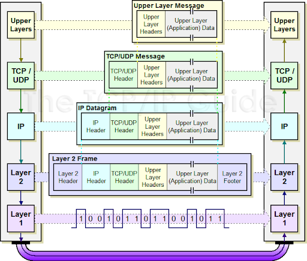

# Modele OSI 

 - *Consulter* l'enoncé `osi.pdf` 
 - *Réaliser* les (TDs)[#]
 - *Réaliser* l'exercice 2 sur PC (fichier de simulation subnetting-cisco-packet-tracer.pkt).
 - [Lien de télèchargement CISCO PACKET TRACER 8.2.2](https://drive.google.com/file/d/1-iHblRkJ6OvOC7pO5D_IUDhekEqS5X6Q/view?usp=sharing)
 ## RESSOURCES
 ### Modele OSI
 - [Vidéo C'est quoi le TCP_IP _.mp4](https://drive.google.com/file/d/1YvrVi-OUch4QSDTG2ucONhIHlGuUWi6_/view?usp=sharing)

 ### Wireshark prise en main
 - [Interface](https://www.it-connect.fr/decouverte-de-linterface-de-wireshark/)
 - [Vidéo de prise en main](https://drive.google.com/file/d/13Q2XU9oKv6Eza9brkqgTODV2PSDz-XRr/view?usp=sharing)

 ### TDs
  - [TD 1](https://github.com/JR-CIEL-1-RESEAU/OSI/archive/refs/tags/avec_zip.zip)
  - [TD 2](https://github.com/user-attachments/files/18267633/TD_Sortie_reseau.zip)
       
 #### Activité : Test de la fragmentation

- Lancez une capture puis la commande « ping –l 2000 172.16.15.254 » et arrêtez la capture lorsque l'invite de commande réapparaît à la console.

- Analysez la partie fragmentation des deux premières trames et donnez le fragment d'offset et les bit MF (More fragments) et DF (Don't fragment) pour chacune ainsi que la longueur.

- Justifiez les résultats de la fragmentation en particulier les valeurs des bits, les offsets et les longueurs totales dans les deux trames.

- Exécutez la commande suivante : « ping -f –l 2000 172.16.15.254 » et justifiez le message d'erreur affiché.et Activité : Analyse de trames ICMP

- L'objectif de cette activité est d'analyser différentes trames ICMP :Lancez une capture puis exécutez la commande « ping 172.16.0.1. » et enfin arrêtez la capture. par ping 172.16.100.1

 ####  Capture des identifiants de connexion FTP
- Connectez vous à un serveur FTP et capturer les informations relatives aux identifiants de connexion 
([Wireshark - View FTP usernames and passwords ](https://www.freekb.net/Article?id=133)).

